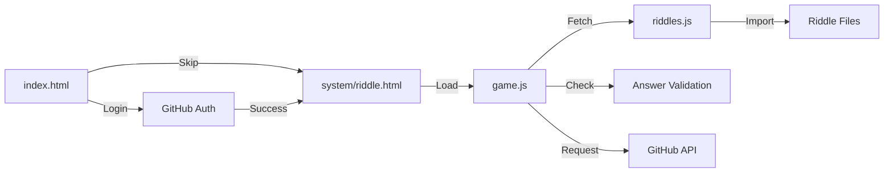

# The Gatekeeper's Riddle - Repository Architecture

**Generated:** 2025-12-05T20:52:00.000Z  
**Version:** 2.0.0

## 📊 Overview

**27 files** | **5,352 lines of code** | **292.79 KB**

A Progressive Web App (PWA) featuring an interactive riddle game with GitHub integration and automated riddle discovery.

## 🗂️ Directory Structure

```
The_GateKeepers_Riddle.Interactive/
├── index.html                 # Login page with GitHub authentication
├── LICENSE                    # MIT License
├── _config.yml               # Jekyll/GitHub Pages configuration
│
├── .github/                   # GitHub-specific files
│   ├── workflows/            # GitHub Actions workflows
│   │   ├── repo-mapper-agent.yml      # Automated repository mapping
│   │   ├── riddle-finder-agent.yml    # Automated riddle discovery
│   │   └── issue-riddle-request.yml   # Issue-based riddle requests
│   ├── agents/               # Agent instruction files
│   ├── ISSUE_TEMPLATE/       # GitHub issue templates
│   └── *.md                  # Documentation files
│
└── system/                    # Application core
    ├── riddle.html           # Main game interface
    │
    ├── css/
    │   └── game.css          # Complete visual styling (638 lines)
    │
    ├── js/
    │   ├── game.js           # Core game logic (547 lines)
    │   ├── auth.js           # GitHub authentication (145 lines)
    │   └── sw.js             # Service worker (87 lines)
    │
    ├── riddles/
    │   ├── riddles.js        # Riddle registry
    │   ├── gatekeeper.riddle.js        # Riddle 1: AI Identity
    │   ├── mirror.riddle.js            # Riddle 2: Algorithms
    │   ├── the-paradox-of-progress.riddle.js  # Riddle 3: Knowledge
    │   └── riddle.template.js          # Template for new riddles
    │
    ├── data/
    │   ├── repo-map.json     # Comprehensive file metadata
    │   ├── code-index.json   # Function/export index
    │   └── ARCHITECTURE.md   # This file
    │
    ├── storage/
    │   ├── manifest.json     # PWA manifest
    │   └── icon.logo.png     # App icon (124 KB)
    │
    └── scripts/
        └── l.h.s.script      # Utility script
```

## 🏗️ Architecture Pattern

**Pattern:** Modular Single Page Application (SPA) with PWA capabilities

### Core Design Principles

1. **Modular Structure**: Separation of concerns (UI, logic, data)
2. **Progressive Enhancement**: Works offline with service worker
3. **Template-Based Extensibility**: Easy addition of new riddles
4. **Optional Authentication**: GitHub token for enhanced features
5. **Automated Workflows**: Self-maintaining with GitHub Actions

## 🔄 Application Flow

### User Journey



### Data Flow

```
┌─────────────────┐
│  User Input     │
└────────┬────────┘
         │
         ▼
┌─────────────────┐      ┌──────────────┐
│   game.js       │─────▶│ localStorage │
│  (Game Logic)   │◀─────│  (Progress)  │
└────────┬────────┘      └──────────────┘
         │
         ▼
┌─────────────────┐      ┌──────────────┐
│  riddles.js     │─────▶│ Riddle Files │
│  (Registry)     │◀─────│   (.js)      │
└────────┬────────┘      └──────────────┘
         │
         ▼
┌─────────────────┐
│   UI Update     │
└─────────────────┘
```

## 📦 Component Breakdown

### 🎨 UI Components

| File | Lines | Purpose |
|------|-------|---------|
| `index.html` | 470 | Login page with GitHub authentication |
| `system/riddle.html` | 210 | Main game interface |
| `system/css/game.css` | 638 | Complete visual styling |

**Features:**
- Responsive design (mobile-optimized)
- Dark theme with gradients
- Modal system (hints, help, answers)
- Floating action buttons
- Compact bubble button bar

### ⚙️ Logic Components

| File | Lines | Functions | Purpose |
|------|-------|-----------|---------|
| `system/js/game.js` | 547 | 27 | Core game mechanics |
| `system/js/auth.js` | 145 | 10 | Authentication & GitHub API |
| `system/js/sw.js` | 87 | 3 | Service worker (PWA) |

**Key Responsibilities:**
- Answer validation and feedback
- Progress tracking (localStorage)
- Riddle navigation
- Modal management
- GitHub issue creation
- Offline caching

### 📚 Data Components

| File | Lines | Purpose |
|------|-------|---------|
| `system/riddles/riddles.js` | 35 | Central registry |
| `system/riddles/gatekeeper.riddle.js` | 56 | Riddle: AI Identity |
| `system/riddles/mirror.riddle.js` | 45 | Riddle: Algorithms |
| `system/riddles/the-paradox-of-progress.riddle.js` | 46 | Riddle: Knowledge |
| `system/riddles/riddle.template.js` | 75 | New riddle template |

**Riddle Structure:**
```javascript
{
  id: string,              // Unique identifier
  title: string,           // Display title
  text: string,            // Riddle text
  correctAnswers: [],      // Valid answers
  closeAnswers: [],        // Near-miss answers
  hints: [],               // Progressive hints (6+)
  wrongAnswerFeedback: "", // Message for wrong
  closeAnswerFeedback: "", // Message for close
  explanation: "",         // Answer explanation
  answer: ""              // Official answer
}
```

### 🤖 Infrastructure Components

| File | Purpose |
|------|---------|
| `system/js/sw.js` | Offline support via service worker |
| `system/storage/manifest.json` | PWA configuration |
| `.github/workflows/*.yml` | Automated workflows |

**Automation Systems:**

1. **Repository Mapper Agent**
   - **Schedule:** Weekly (Sunday midnight)
   - **Triggers:** Code changes, manual
   - **Outputs:** repo-map.json, code-index.json, ARCHITECTURE.md

2. **Riddle Finder Agent**
   - **Schedule:** Daily
   - **Triggers:** Manual, issue labels
   - **Outputs:** New riddle files, pull requests

3. **Issue Riddle Request Handler**
   - **Triggers:** New issues, labels
   - **Action:** Triggers Riddle Finder Agent

## 🔗 Dependencies & Relationships

### Import Graph

```
index.html
  └─→ system/js/auth.js

system/riddle.html
  ├─→ system/css/game.css
  ├─→ system/js/game.js
  └─→ system/js/auth.js (indirect)

system/js/game.js
  ├─→ system/riddles/riddles.js
  └─→ system/js/auth.js

system/riddles/riddles.js
  ├─→ system/riddles/gatekeeper.riddle.js
  ├─→ system/riddles/mirror.riddle.js
  └─→ system/riddles/the-paradox-of-progress.riddle.js
```

### Shared Utilities

**system/js/auth.js**
- Used by: `index.html`, `system/js/game.js`
- Exports: 10 functions
- Purpose: Authentication and GitHub API integration

**system/riddles/riddles.js**
- Used by: `system/js/game.js`
- Exports: 5 functions + riddles array
- Purpose: Central riddle management

## 💾 Storage Strategy

### LocalStorage Keys

| Key | Type | Purpose |
|-----|------|---------|
| `github_token` | string | GitHub Personal Access Token |
| `riddleProgress` | JSON | Attempts and solved status per riddle |
| `currentRiddleIndex` | number | Last viewed riddle index |

### Service Worker Cache

**Cache Name:** `gatekeeper-riddle-v5`

**Strategy:** Cache-first with network fallback

**Cached Resources:**
- HTML pages (/, /index.html, /system/riddle.html)
- JavaScript modules (auth.js, game.js, riddles/*.js)
- Stylesheets (game.css)
- Assets (manifest.json, icon.logo.png)

## 🔌 API Integration

### GitHub REST API

**Base URL:** `https://api.github.com`

**Endpoints:**

1. **Verify Token**
   - **Method:** GET /user
   - **Purpose:** Validate GitHub token
   - **Auth:** Bearer token

2. **Create Issue**
   - **Method:** POST /repos/{owner}/{repo}/issues
   - **Purpose:** Request new riddles
   - **Auth:** Bearer token
   - **Body:** title, labels, body

**Rate Limiting:** Monitored via response headers

## 🎯 Key Features

### Game Mechanics
- ✅ Multiple riddles with navigation
- ✅ Smart answer detection (multiple variations)
- ✅ Close answer recognition
- ✅ Per-riddle progress tracking
- ✅ Progressive hint system
- ✅ Give up / reveal answer

### User Experience
- ✅ Mobile-optimized interface
- ✅ Dark theme with animations
- ✅ Modal system (hints, help, answers)
- ✅ Floating action buttons
- ✅ Keyboard shortcuts (Enter, Escape)

### Technical Features
- ✅ PWA with offline support
- ✅ Service worker caching
- ✅ GitHub authentication (optional)
- ✅ AI riddle requests
- ✅ Zero external dependencies
- ✅ ES6 modules

### Automation
- ✅ Auto-generated documentation
- ✅ Automated riddle discovery
- ✅ Issue-based riddle requests
- ✅ Self-maintaining repository

## 📈 Metrics

| Metric | Value |
|--------|-------|
| Total Functions | 38 |
| Total Exports | 23 |
| Event Listeners | 15+ |
| API Endpoints | 2 |
| Riddles | 3 |
| Automated Workflows | 3 |
| Languages | 8 |

## 🚀 Extension Points

### Adding New Riddles

1. Copy `system/riddles/riddle.template.js`
2. Rename to `{name}.riddle.js`
3. Fill in all required fields
4. Import in `system/riddles/riddles.js`
5. Add to riddles array
6. Update service worker cache list

### Adding New Features

- **New modal:** Add to HTML, update game.js event handlers
- **New API endpoint:** Add to auth.js
- **New storage key:** Document in localStorage section
- **New automation:** Create workflow in `.github/workflows/`

## 🔒 Security Considerations

- GitHub tokens stored in localStorage (client-side only)
- Content Security Policy in place
- Token validation before API calls
- Rate limit monitoring
- No server-side processing

## 📱 PWA Configuration

**Manifest:** `system/storage/manifest.json`

- **Name:** The Gatekeeper's Riddle
- **Display:** Standalone
- **Theme:** Dark (#0a0a0a background, #64ffda accent)
- **Icon:** 860x844 PNG
- **Orientation:** Portrait-primary

**Installation:**
- iOS: Add to Home Screen
- Android: Install App prompt

## 🧪 Testing & Validation

- No automated test suite (manual testing)
- Validation via usage
- Security scanning via CodeQL (if configured)

## 📄 License

MIT License - See LICENSE file

---

**Last Updated:** 2025-12-05T20:52:00.000Z  
**Maintained By:** Repository Mapper Agent  
**Repository:** [statikfintechllc/The_GateKeepers_Riddle.Interactive](https://github.com/statikfintechllc/The_GateKeepers_Riddle.Interactive)
